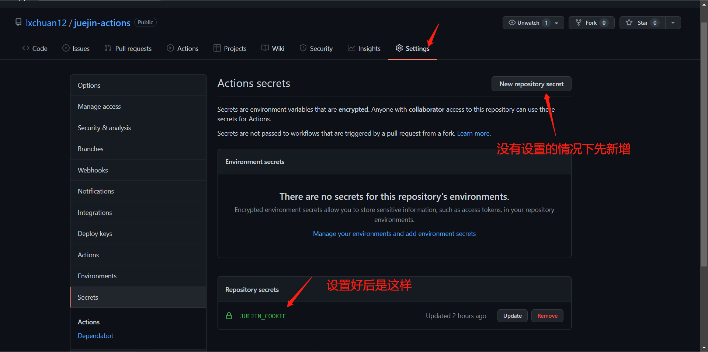
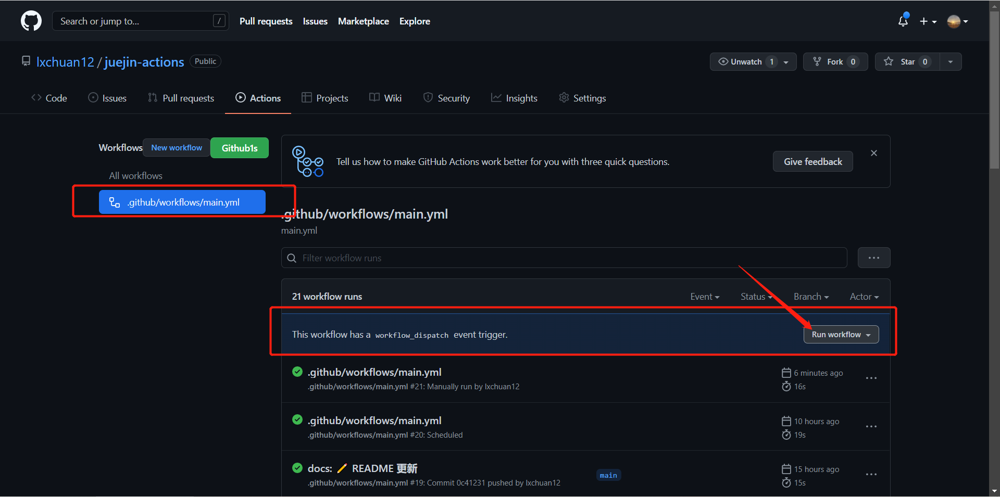
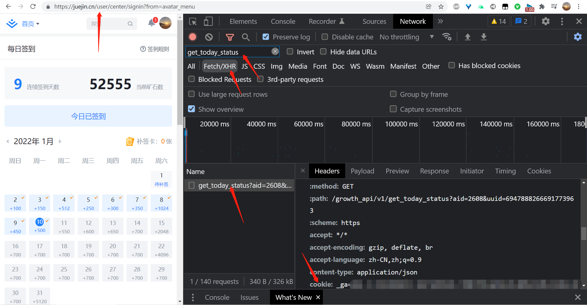

# juejin-actions

> 每天掘金自动签到 时间自定义，默认8:00

你好，我是[**若川**](https://lxchuan12.gitee.io)。目前持续组织了5个月[每周一起学200行左右源码共读活动](https://www.yuque.com/ruochuan12/topics/1)，每周一期，已进行到20期，感兴趣的可以加我微信 [ruochuan12](https://mp.weixin.qq.com/s?__biz=MzA5MjQwMzQyNw==&mid=2650756550&idx=1&sn=9acc5e30325963e455f53ec2f64c1fdd&chksm=8866564abf11df5c41307dba3eb84e8e14de900e1b3500aaebe802aff05b0ba2c24e4690516b&token=917686367&lang=zh_CN#rd) 加群参与，长期交流学习。

## 使用

### fork 我的项目

在项目 `settings => secrets` 添加 `JUEJIN_COOKIE` 字段，设置值为`掘金 cookie`，设置好可以手动触发一次，验证是否正确，下次就会定时触发了，再也不用担心签到了。
> `掘金 cookie` 好像一个月内有效，退出登录后也无效，需要及时更换 `cookie`。





如图所示，就成功了。


**获取 `掘金 cookie` 方法**

[打开这个页面，登录后，按F12打开开发者工具，刷新页面](https://juejin.cn/user/center/signin?from=avatar_menu)

在 `fetch/xhr` 搜索过滤 `get_today_status` 这个接口，在 `Request Headers` 中复制 `cookie` 的值。如下图所示：



#### 开启邮箱发送日志的服务

在项目 `settings => secrets` 中需要额外添加以下字段

|              字段名 | 含义                | 默认值         |
|-----------------:|:------------------|-------------|
|      MAIL_SENDER | 发送方邮箱             | -           |
|    SMTP_PASSWORD | 发送方SMTP服务的授权码或者口令 | -           |
| MAIL_HOST_SENDER | 发送邮件服务器           | smtp.qq.com |
| MAIL_PORT_SENDER | 发送邮件服务器的端口号       | 465         |
|   MAIL_RECIPIENT | 邮件接受方             | -           |

以QQ邮箱为例


|              字段名 | 举例               |
|-----------------:|:-----------------|
|      MAIL_SENDER | xxx@qq.com（自己邮箱） |
|    SMTP_PASSWORD | 上图获取的授权码         |
| MAIL_HOST_SENDER | smtp.qq.com      |
| MAIL_PORT_SENDER | 465              |
|   MAIL_RECIPIENT | xxx@qq.com（自己邮箱） |

### 新建项目或者已有项目

添加 `.github/workflows/main.yml` 文件，其中 `main` 可以自定义成其他名称。

```yml
on:
  push:
  schedule:
    # 定时任务 每天 11:00 自动签到，按照计划任务队列，可能延迟 3 + 8 = 北京时间 11
    - cron: '00 3 * * *'

jobs:
  juejin:
    runs-on: ubuntu-latest
    name: 掘金自动签到
    steps:
      - name: Hello world action step
        id: hello
        uses: lxchuan12/juejin-actions@main
        env:
          JUEJIN_COOKIE: ${{secrets.JUEJIN_COOKIE}}
        with:
          who-to-greet: '若川'
      # Use the output from the `hello` step
      - name: Get the output
        run: |
          echo "The time was ${{ steps.hello.outputs.time }}"
          echo "签到结果： ${{ steps.hello.outputs.checkInResult }}"
```

同样在项目 `settings => secrets` 添加 `JUEJIN_COOKIE` 字段，设置值为`掘金 cookie`。

## 本地开发

```bash
# git clone https://github.com/lxchuan12/juejin-actions.git
npm i -g pnpm
pnpm install
```
## 本地测试

在 `test/env.js` 文件代码配置相应配置。

```bash
npm run test
```
